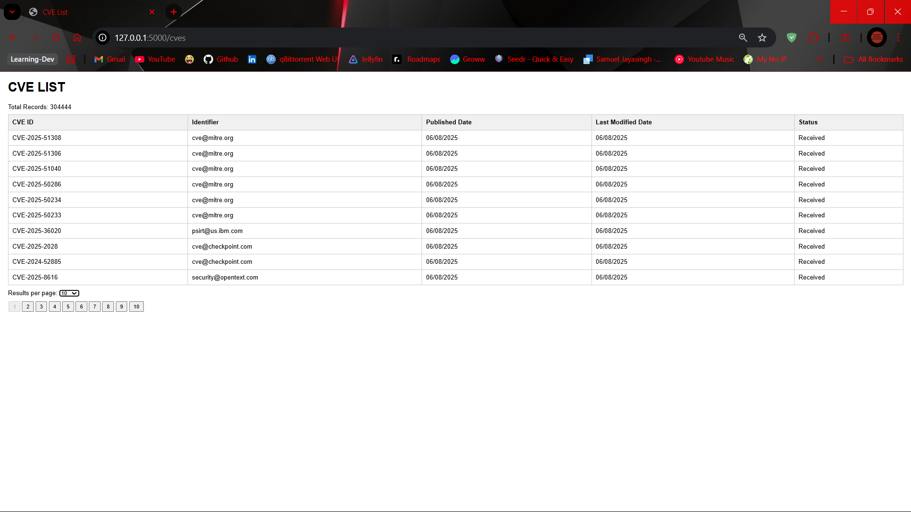
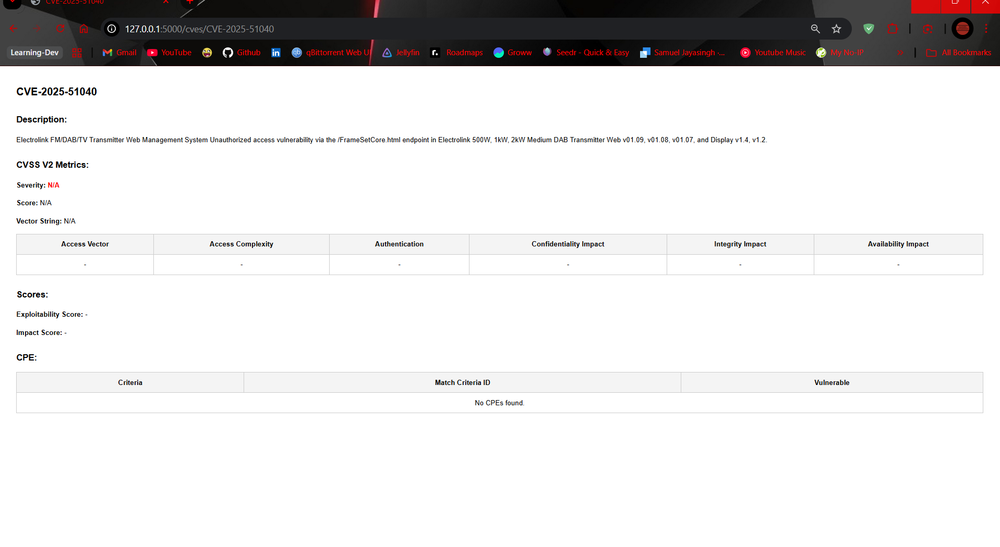
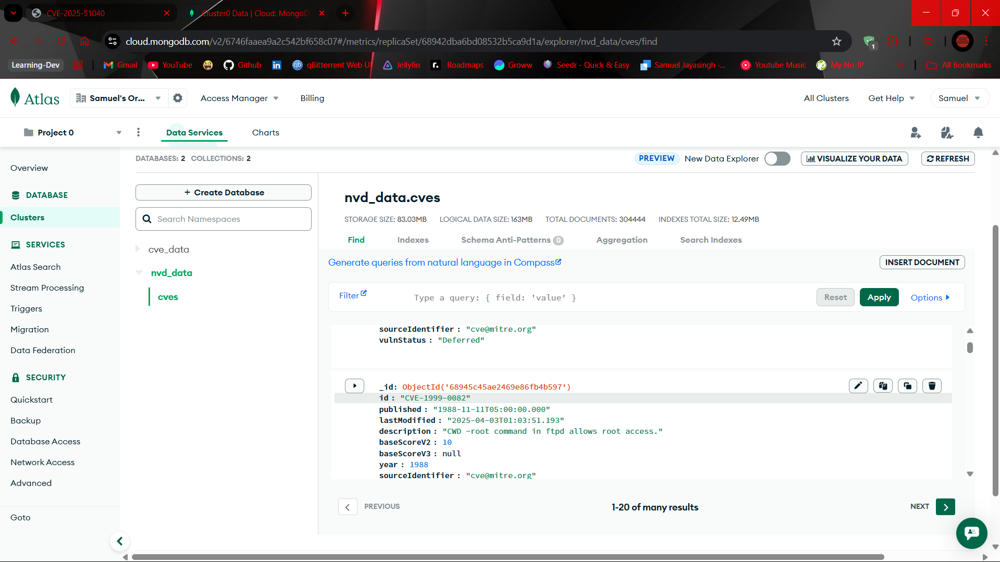

# Securin NVD_Assignment

This project ingests, preprocesses, and visualizes Common Vulnerabilities and Exposures (CVE) data from the National Vulnerability Database (NVD). It supports full and incremental data sync, stores cleaned data in MongoDB, and serves it through a web dashboard and API built with Flask.

---

## Features

* Full and incremental CVE data synchronization
* Data cleaning and deduplication
* MongoDB integration with upsert logic to prevent duplication
* REST APIs for listing and retrieving CVE details
* Frontend with pagination, sorting, and CVE detail views

---

## Project Structure

```
SECURIN_NVD/
├── static/                     # Static assets
│   └── style.css              # Basic styles
│
├── templates/                 # HTML templates (Jinja2)
│   ├── list.html             # CVE list interface
│   └── detail.html           # CVE detail interface
│
├── .env                      # Environment variables (MongoDB credentials)
├── app.py                    # Flask server and route definitions
├── fetch_utils.py            # Utilities for fetching NVD API data
├── preprocess_utils.py       # Functions to clean and deduplicate CVE data
├── mongo_config.py           # MongoDB client setup
├── main.py                   # Manual or scheduled data sync entry point
├── test.ipynb                # (Optional) Notebook used for my testing
└── README.md                 # Project documentation
```

---

## Setup Instructions

### 1. Clone the Repository

```bash
git clone https://github.com/SamuelJayasingh/Securin_NVD-Assignment.git
cd Securin_NVD-Assignment
```

### 2. Install Dependencies

```bash
pip install -r requirements.txt
```

Or install manually:

```bash
pip install flask flask-cors pymongo apscheduler python-dotenv tqdm
```

### 3. Configure Environment Variables

Create a `.env` file:

```env
MONGO_URI=mongodb://localhost:27017/
MONGO_DB=nvd_data
MONGO_COLLECTION=cves
```

For MongoDB Atlas:

```env
MONGO_URI=mongodb+srv://<user>:<password>@cluster.mongodb.net/
```

---

## CVE Data Sync Options

### Manual JSON Upload

If you already have a preprocessed file named `nvd_cleaned.json`, you can upload it directly to MongoDB by running:

```bash
python main.py
```

> **Note:**
> The `nvd_cleaned.json` file was prepared by running the `fetch_utils.py` and `preprocess_utils.py` modules.
> It is not included in this repository due to Git LFS storage limitations.

### Full Sync from NVD API

Run `full_sync()` in `main.py` (or trigger it manually) to fetch the entire dataset from the NVD API and push it to MongoDB.

### Scheduled Sync

You can enable APScheduler in `main.py`:

```python
# scheduler.add_job(full_sync, 'cron', hour=1)
# scheduler.add_job(incremental_sync, 'interval', hours=2)
```

---

## Flask Web App

### Start the Server

```bash
python app.py
```

### Available Routes

| Endpoint             | Method | Description                       |
| -------------------- | ------ | --------------------------------- |
| `/`                  | GET    | Health check route                |
| `/cves`              | GET    | Renders CVE list page             |
| `/cves/list`         | GET    | Returns paginated CVE list (JSON) |
| `/cves/<cve_id>`     | GET    | Renders CVE detail page (HTML)    |
| `/api/cves/<cve_id>` | GET    | Returns CVE detail (JSON)         |

### Query Parameters for `/cves/list`

| Parameter        | Description                                   |
| ---------------- | --------------------------------------------- |
| `page`           | Page number (default: 1)                      |
| `resultsPerPage` | Records per page (10, 50, 100)                |
| `sortBy`         | Field to sort by: `published`, `lastModified` |
| `order`          | Sort direction: `asc`, `desc`                 |

---

## Frontend Functionality

* The `/cves` page displays a table of CVE records with:

  * CVE ID, Identifier, Published Date, Last Modified, Status
  * Pagination
  * "Results per page" selection
* Clicking a row navigates to `/cves/<CVE-ID>`, rendering detailed metrics, scores, and CPE data

---

## Notes

* All data operations are backed by MongoDB with upserts to prevent duplicates
* The `preprocess_utils.py` module ensures consistency in format and structure
* The API supports server-side pagination and sorting
* `fetch_utils.py` handles optional NVD API query parameters for incremental sync

---

## Testing

I used  `test.ipynb` to experiment with API calls, check data structure and to preprocess the data.

## Screenshots

### 1. CVE List Page
...


### 2. CVE Detail Page
...


### 3. MongoDB Data View
...

---
